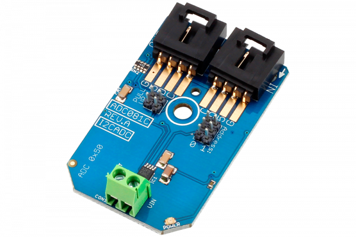

[](https://store.ncd.io/product/adc081c-8-bit-1-channel-high-speed-analog-to-digital-converter-i2c-mini-module/).

# ADC081C
ADC081C is a 8-Bit 1-Channel High-Speed Analog to Digital Converter.
This Device is available from www.ncd.io

[SKU: ADC081C_I2CS]

(https://store.ncd.io/product/adc081c-8-bit-1-channel-high-speed-analog-to-digital-converter-i2c-mini-module/)
This Sample code can be used with Raspberry Pi.

Hardware needed to interface ADC081C With Raspberry Pi : 
1. <a href="https://store.ncd.io/product/adc081c-8-bit-1-channel-high-speed-analog-to-digital-converter-i2c-mini-module/">ADC081C 8-Bit 1-Channel High-Speed Analog to Digital Converte</a>
2. <a href="https://store.ncd.io/product/i2c-shield-for-raspberry-pi-3-pi2-with-outward-facing-i2c-port-terminates-over-hdmi-port/">Raspberry Pi I2C Shield</a>
3. <a href="https://store.ncd.io/product/i%C2%B2c-cable/">I2C Cable</a>

## Python
Download and install smbus library on Raspberry pi. Steps to install smbus are provided at:
https://pypi.python.org/pypi/smbus-cffi/0.5.1
Download (or git pull) the code in pi. Run the program.

```cpp
$> python ADC081C.py
```
The lib is a sample library, you will need to calibrate the sensor according to your application requirement.


